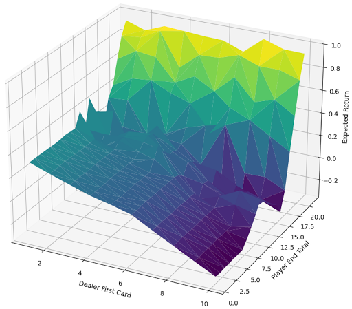
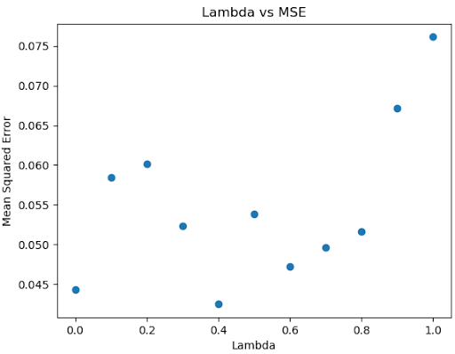
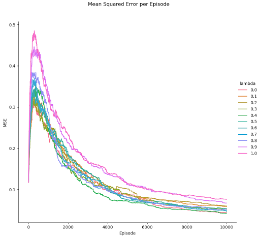

# Easy21
(Unfinished) Assignment for David Silver's RL Course
https://www.davidsilver.uk/wp-content/uploads/2020/03/Easy21-Johannes.pdf

---

Credits to timbmg for plotQ and plotMseEpisodesLambdas in utils.py (https://github.com/timbmg/easy21-rl)

## Results of Each Algorithm

### Monte Carlo Control (Every Visit)

### Sarsa(lambda)

