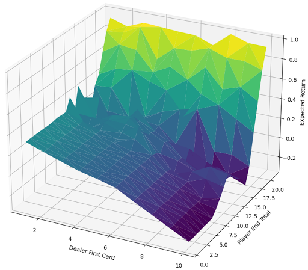
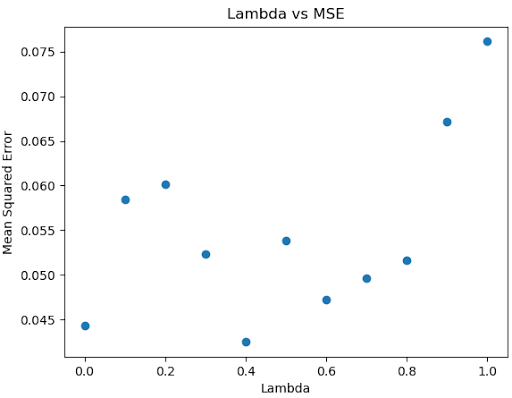
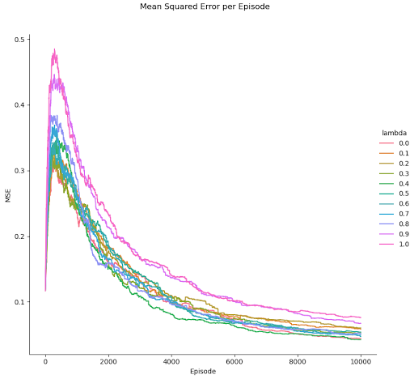
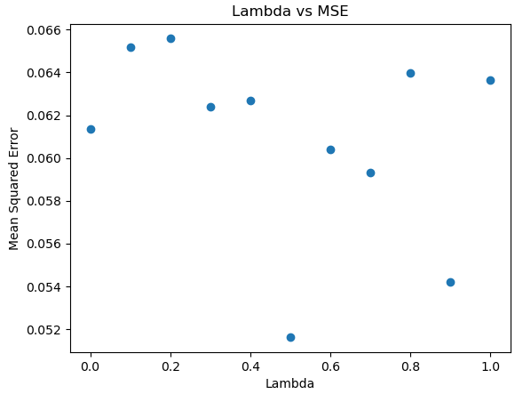
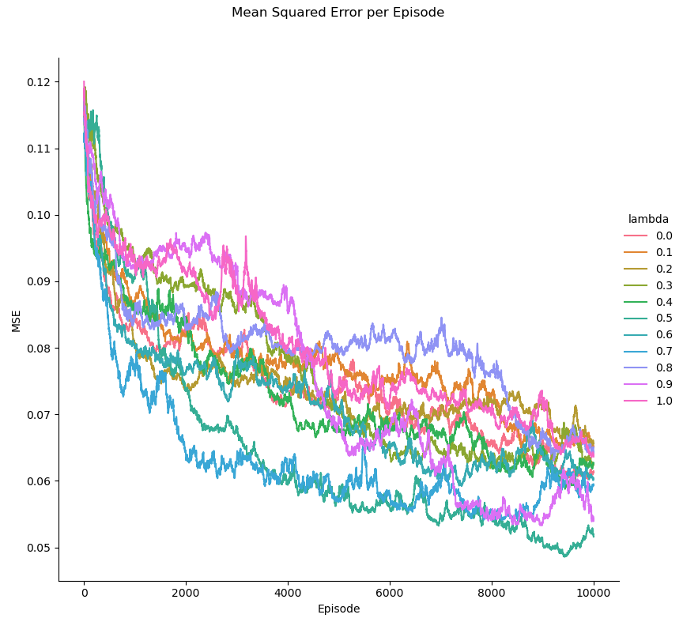

# Easy21
Assignment for David Silver's RL Course
https://www.davidsilver.uk/wp-content/uploads/2020/03/Easy21-Johannes.pdf

---

Credits to timbmg for plotQ and plotMseEpisodesLambdas in utils.py (https://github.com/timbmg/easy21-rl)

## Results of Each Algorithm

### Monte Carlo Control (Every Visit)
After training over 10 million episodes, the value function:

### Sarsa(lambda)
After training over 10,000 episodes per lambda in {0, 0.1, 0.2, ..., 1}, MSE between Q (sarsa) and QStar(monte carlo result) per lambda:

MSE throughout training per lambda:

### Sarsa(lambda) Q-function Approximation
After training over 10,000 episodes per lambda in {0, 0.1, 0.2, ..., 1}, MSE between Q (function approximation) and QStar (monte carlo result) per lambda:

MSE throughout training per lambda:
